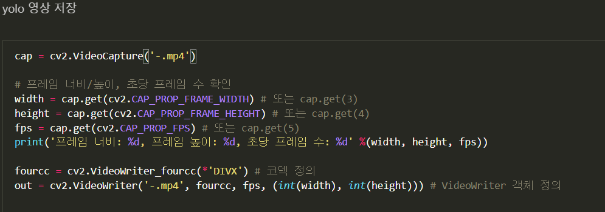
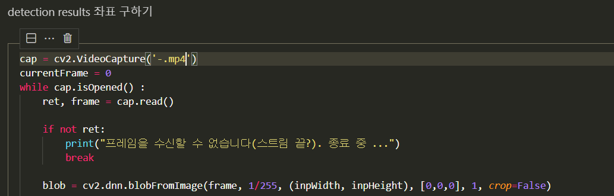

# YOLO

## YOLO v3 

### object tracking and object detection

1. object tracking

   - 바운딩 박스의 크기 변화에 따라 상대 속도 감지
     - 빨간색 : 감속
     - 파랑색 : 가속

   

> 실행 방법
>
> python3 main.py -i [입력이미지 경로] -c [검출할 클래스명]
>
> **VOC dataset으로 학습되어 있음**
>
> - 클래스 종류
>
>   ```
>   aeroplane
>   bicycle
>   bird
>   boat
>   bottle
>   bus
>   car
>   cat
>   chair
>   cow
>   diningtable
>   dog
>   horse
>   motorbike
>   person
>   pottedplant
>   sheep
>   sofa
>   train
>   tvmonitor
>   ```
>
>   

2. object detection

   

>  **Object_detection.ipynb**
>
> opencv의 darknet framework로 Yolo v3 실행
>
> 
>
> yolo 영상 저장
>
> line 1 : '-.mp4'  ( 재생 영상 경로 입력)
>
> line 10 : '-.mp4' (저장할 경로 입력)
>
> 
>
> detection 결과 저장
>
> line 1 : '-.mp4' ( 재생 영상 경로 입력)