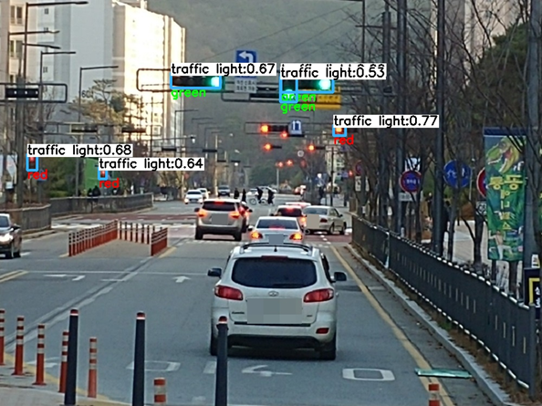
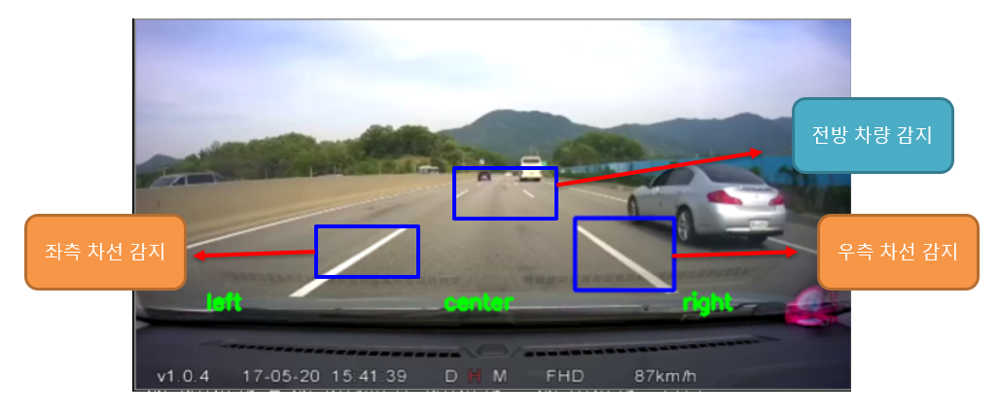

#  카메라를 활용한 물체 인식 구현 (파이널 프로젝트)

### 팀명 : Varchar(5)

### 팀원 : **김동현**, 노용철, **정성훈**, 홍세준


## 주제선정 및 배경

이번 프로젝트에서는 카메라로 들어온 영상 정보를 활용하여 Object Detection, segmentation으로 차량과 차선등의 주변 환경 detection을 한다. 차량 주변 환경 정보를 통해서 앞차와의 거리, 차량의 steering 상태를 출력해주는 서비스이다. 또한 강화학습을 통해 차량의 steering과 acceleration을 제어하는 모델도 만들어본다.  


# 프로젝트 임무 분담

1. object detection : 김동현
   1. YOLO v3 
   2. YOLO v3 tracking
2. lane detection : 노용철
   1. LANENET
3. reinforce learning : 정성훈
4. object detection , lane detection : 홍세준


### 결과의 유용성

- 소형화된 LiDAR센서와 고화질의 카메라 모듈을 통해 프로토 타입의 자율주행차를 제작하여 현업에서의 활용 가능성을 기대해보고 이를 바탕으로 무인 배송차, 방범용 로봇 등 무인화 가능한 전반적인 산업에 응용할 수 있다. 또한 최근 이슈화 되고 있는 어린이 보호구역에서의 사고 예방 등 산업을 떠난 일상의 안전에도 기여할 것으로 예상된다.

### 프로젝트 결과

1. YOLO v3 

   1. 블랙박스 영상을 활용하여 차량 검출

      

      

   2. bounding box와 HSV 변환을 활용한 신호등 색깔 검출

      

      

2. YOLO tracking

   1. bounding box 크기를 활용한 차량 속도 표시 ( 작아지면(멀어짐) 파란색, 커지면(가까워짐) 빨간색 ) 

      

3. lanenet

   1. 차선 검출 및 comment 적용

      

4. YOLO v3 + LANENET ( 최종 서비스 구현 )

   

   1. 고속도로

      

      2. 도심

         

5. reinforce learning

   1. epicode 400

      

   2. episode 600

      


블랙 박스 영상을 활용하여 YOLO v3와 LANENET을 적용


### **프로젝트 실행방법**

**필요한 것**

파이썬 3.6

tensorflow ==1.12 tensorflow-gpu == 1.12

(cuda 9.0 cuDNN 7.2)

numpy
tqdm
glog
easydict
tensorflow_gpu
matplotlib
opencv4
scikit_learn
loguru


1. lanenet weight 파일 압축풀기

   4\.Final_model/weight2/tusimple_lanenet.ckpt.zip

2. yolo weight 파일 분할 압축 풀기

   4\.Final_model/yoloweight

```
python3 final.py --video [영상 경로]
```


### 현재 프로젝트에서 아쉬운 점

1. YOLO tracking과 LANENET을 함께 활용하지 못하였다. 
2. 강화학습을 블랙박스 영상에 적용하지 못하였다. 
3. 시뮬레이션을 통해 다양한 상황(밤,비오는날 등)에 적용해보지 못했다.

### 추후 적용해볼 내용

1. 실시간 객체 인식과 차선 인식
2. 실시간 검출 모델을 라즈베리 파이나 기타 소형 컴퓨터에 적용 후 FPS 확인
3. LANENET과 YOLO의 객체 검출을 바탕으로 강화 학습을 진행 후 차량 제어
